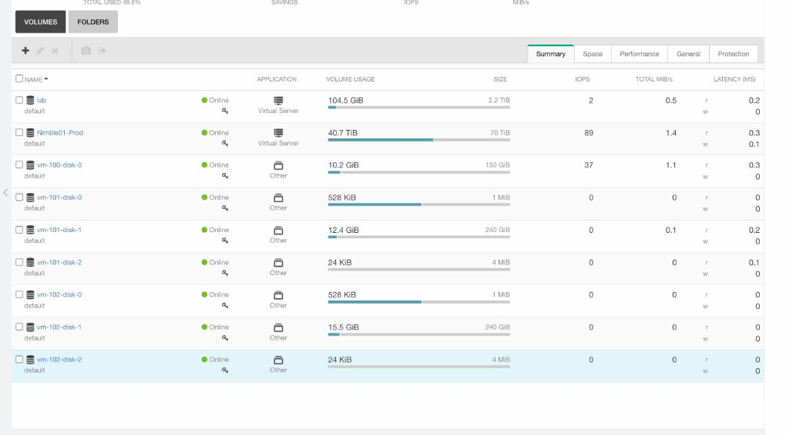
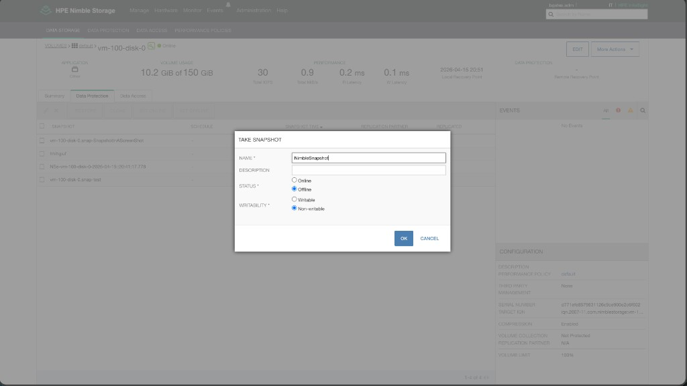
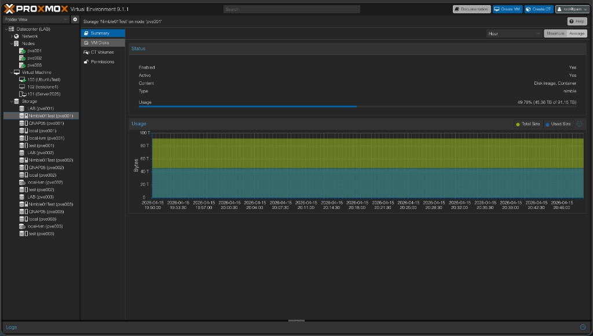
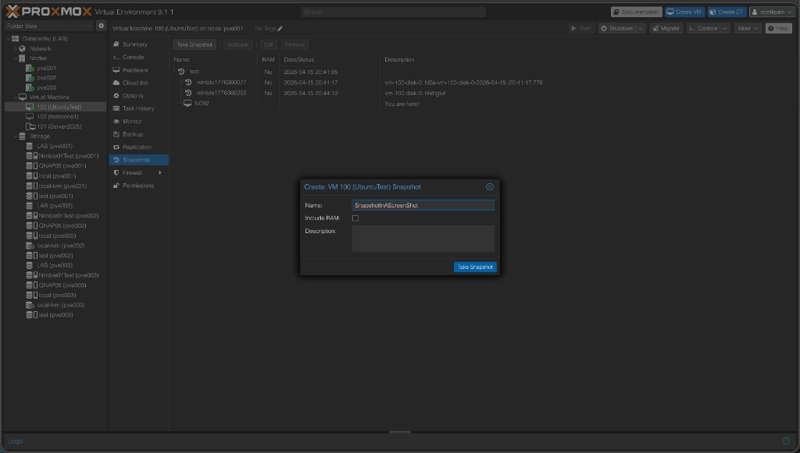
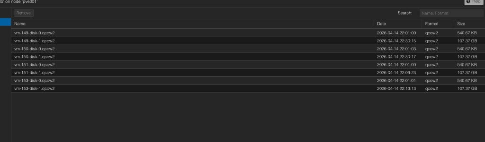
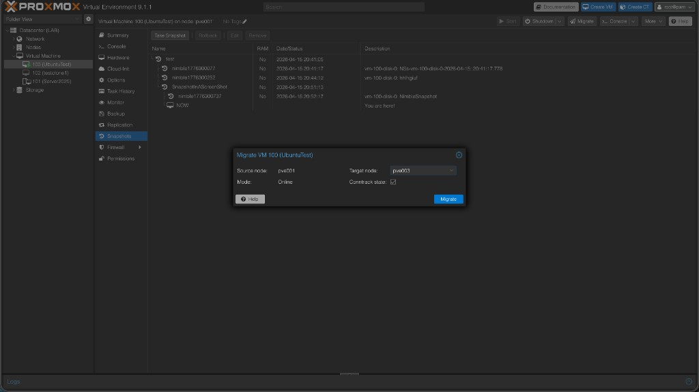
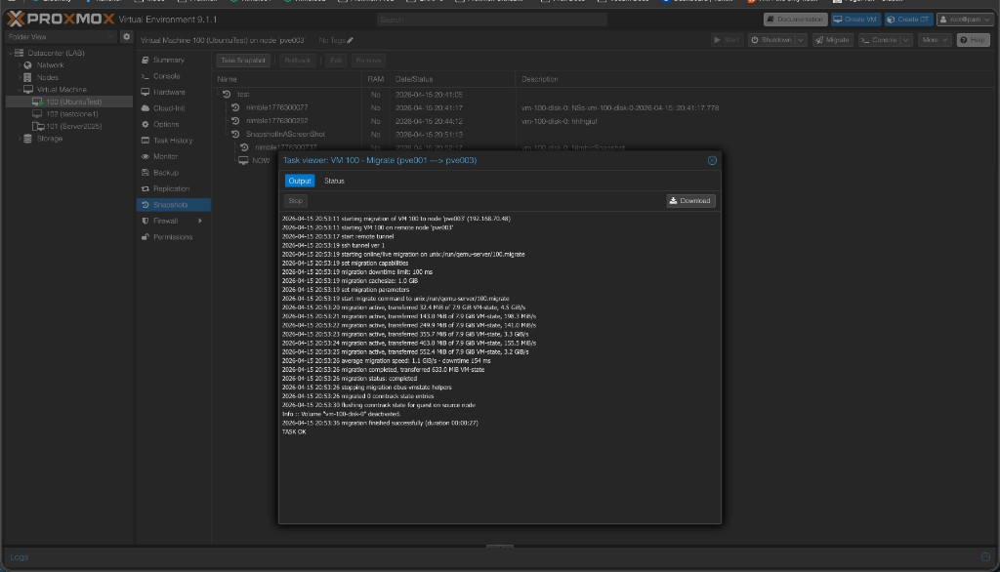
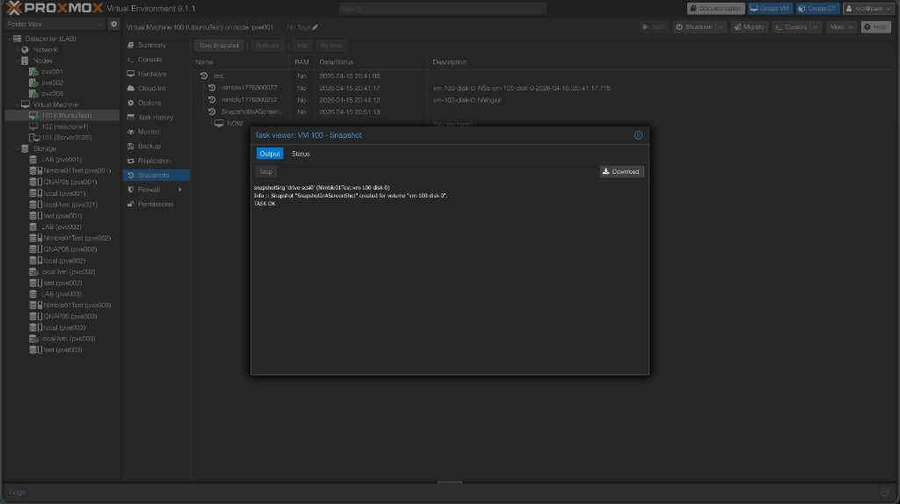
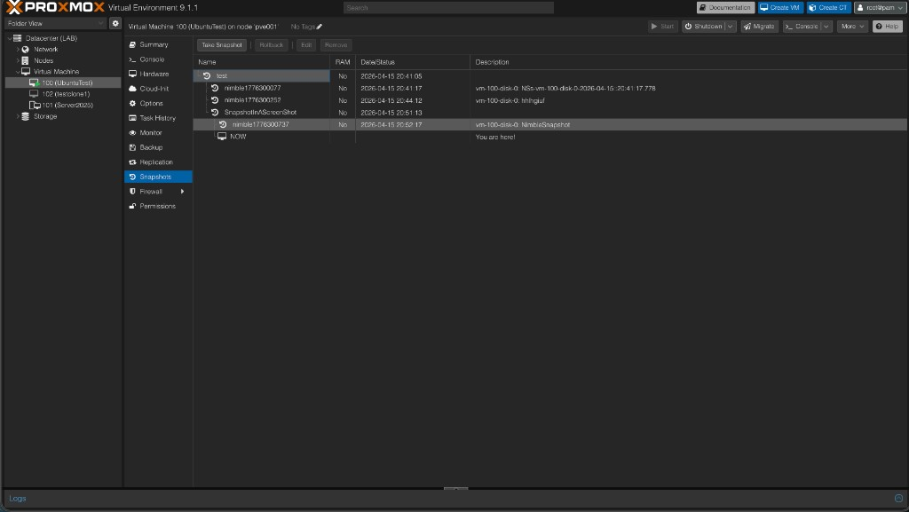

# 0 – Setting up fully protected storage in a Proxmox cluster

This guide walks you from **zero** to **fully protected** HPE Nimble storage in a Proxmox VE cluster: one LUN per **VM disk or LXC root** (`rootdir`), array snapshots (walkthrough uses **QEMU** VMs), optional multipath, and optional auto iSCSI discovery.

---

## Table of contents

- [At a glance](#at-a-glance)
- [What you get when you're done](#what-you-get-when-youre-done)
- [Prerequisites checklist](#prerequisites-checklist)
- [1. Plan your network](#1-plan-your-network)
- [2. Prepare the Nimble array](#2-prepare-the-nimble-array)
- [3. Install the plugin on every node](#3-install-the-plugin-on-every-node)
- [4. Configure open-iscsi (IQN)](#4-configure-open-iscsi-iqn)
- [5. Configure multipath (optional but recommended)](#5-configure-multipath-optional-but-recommended)
- [6. Add Nimble storage to Proxmox](#6-add-nimble-storage-to-proxmox)
- [7. Verify storage](#7-verify-storage)
- [8. Create a VM or LXC disk and test](#8-create-a-vm-or-lxc-disk-and-test)
- [8.1 Live migration (optional)](#81-live-migration-optional)
- [9. Test snapshots and rollback](#9-test-snapshots-and-rollback)
- [10. Restore a disk from the array (workflow)](#10-restore-a-disk-from-the-array-workflow)
- [Quick reference](#quick-reference)
- [Troubleshooting](#troubleshooting)

---

## At a glance

| Step | What you do | Time |
|------|-------------|------|
| 1 | Plan management + iSCSI VLANs and IPs | 5 min |
| 2 | Ensure Nimble has REST API + iSCSI subnets | 5 min |
| 3 | Install plugin on **every** cluster node (installs open-iscsi too) | 2 min |
| 4 | Verify/set IQN in `/etc/iscsi/initiatorname.iscsi` | 1 min |
| 5 | Configure multipath (optional) | 5 min |
| 6 | Add Nimble storage (auto iSCSI discovery on by default) | 2 min |
| 7 | Verify storage in Proxmox UI | 2 min |
| 8 | Create a VM disk (and optionally an LXC on `rootdir`) and test | 5 min |
| 9 | Test snapshots and rollback (QEMU VM) | 5 min |
| 10 | Restore a disk from array snapshot (reference) | – |

---

## What you get when you're done

- **One LUN per VM disk or LXC root** – No giant LUN + LVM; each QEMU disk or **container root** (`rootdir`) is a Nimble volume (raw block).
- **Array snapshots** – Create, delete, and rollback from the Proxmox UI (this guide’s snapshot steps focus on **QEMU**; LXC uses normal CT snapshot/backup workflows on the same storage).
- **Resize** – Grow disks from the UI; array and guest resize.
- **Multipath (optional)** – Redundant paths to the array.
- **Cluster-ready** – Same storage on all nodes; plugin runs on each node when needed.

---

## Prerequisites checklist

Before you start, confirm:

- [ ] Proxmox VE cluster (or single node) – 8.2+ recommended.
- [ ] HPE Nimble array with **REST API** enabled (port 5392) and at least one **iSCSI** subnet (discovery IPs).
- [ ] Network: management reachable from Proxmox; iSCSI VLANs/IPs planned.
- [ ] Nimble API user (e.g. admin) with permission to create volumes and initiator groups.
- [ ] Root or sudo on all Proxmox nodes.

---

## 1. Plan your network

You need:

- **Management** – One IP (or VLAN) so Proxmox can reach the Nimble at `https://<mgmt_ip>:5392` for the REST API.
- **iSCSI** – One or more subnets/VLANs where the Nimble exposes **discovery IPs**. Each Proxmox node needs at least one NIC (or VLAN interface) that can reach those discovery IPs.

<details>
<summary>Example: two iSCSI VLANs (dual path)</summary>

- Nimble: discovery IP 10.0.1.5 (VLAN 100), discovery IP 10.0.2.5 (VLAN 200).
- Each Proxmox node: e.g. eth1 → 10.0.1.10 (VLAN 100), eth2 → 10.0.2.10 (VLAN 200).
- Result: two paths per LUN (multipath).

</details>

---

## 2. Prepare the Nimble array

- **REST API:** In the Nimble UI, ensure the management interface is reachable and the REST API is enabled (default port 5392).
- **iSCSI subnets:** Create or confirm at least one iSCSI-enabled subnet (type **data** or **mgmt,data**) with a **discovery IP**. The plugin uses this for **activate-time** iSCSI discovery by default (`auto_iscsi_discovery` defaults to **on**; set **`no`**/**`0`** to disable).
- **User:** Ensure your API user can create volumes, initiator groups, and access control records.

After volumes exist, the **Nimble UI** lists them by name (often `vm-<vmid>-disk-*` when created from Proxmox) with usage and performance:



You can also take **array-side** snapshots from the volume’s Data Protection tab (separate from Proxmox VM snapshots; useful for schedules and recovery workflows):



<details>
<summary>Verify API from a Proxmox node</summary>

```bash
curl -sk -X POST "https://<NIMBLE_MGMT_IP>:5392/v1/tokens" \
  -H "Content-Type: application/json" \
  -d '{"data":{"username":"<user>","password":"<password>"}}'
```

You should get JSON with `data.session_token`. If you see that, the array is ready.
</details>

---

## 3. Install the plugin on every node

Storage config syncs via corosync, but the plugin file must be present on each node.

**Scripted install (recommended)** — handles repo setup, dependencies, service restarts, and can install on all nodes at once:

```bash
# Single node
curl -fsSL https://raw.githubusercontent.com/brngates98/pve-nimble-plugin/main/scripts/install-pve-nimble-plugin.sh | sudo bash

# All cluster nodes at once (dry-run first, then install)
curl -fsSL https://raw.githubusercontent.com/brngates98/pve-nimble-plugin/main/scripts/install-pve-nimble-plugin.sh | sudo bash -s -- --all-nodes --dry-run
curl -fsSL https://raw.githubusercontent.com/brngates98/pve-nimble-plugin/main/scripts/install-pve-nimble-plugin.sh | sudo bash -s -- --all-nodes
```

**Manual APT**

```bash
echo "deb [trusted=yes] https://brngates98.github.io/pve-nimble-plugin bookworm main" | sudo tee /etc/apt/sources.list.d/pve-nimble-plugin.list
sudo apt update && sudo apt install libpve-storage-nimble-perl
```

**Download .deb** — grab a specific release from the [releases page](https://github.com/brngates98/pve-nimble-plugin/releases):

```bash
sudo apt install ./libpve-storage-nimble-perl_<version>-1_all.deb
```

Verify:

```bash
dpkg -l | grep libpve-storage-nimble-perl
```

---

## 4. Configure open-iscsi (IQN)

The plugin uses the host’s iSCSI IQN to register with the Nimble. The scripted installer installs `open-iscsi` automatically. If you installed manually, install it now:

```bash
sudo apt install open-iscsi
```

Verify the IQN is set:

```bash
sudo cat /etc/iscsi/initiatorname.iscsi
```

You should see a line like `InitiatorName=iqn.1993-08.org.debian:01:...`. If the file is missing or empty, create it:

```bash
# Replace with your desired IQN (often one per node)
echo "InitiatorName=iqn.1993-08.org.debian:01:$(hostname)" | sudo tee /etc/iscsi/initiatorname.iscsi
sudo systemctl restart iscsid
```

Confirm at least one iSCSI host exists:

```bash
ls /sys/class/iscsi_host/
# Should list at least one host (e.g. host1).
```

---

## 5. Configure multipath (optional but recommended)

For redundant paths, configure multipath so only array LUNs are multipathed (not local disks).

1. Install and enable multipath:

   ```bash
   sudo apt install multipath-tools
   sudo systemctl enable multipathd
   sudo systemctl start multipathd
   ```

2. Edit `/etc/multipath.conf` – use a config that **blacklists** everything, then **blacklist_exceptions** for Nimble (and any other arrays). Example (Nimble only):

<details>
<summary>Example multipath.conf (Nimble only)</summary>

```text
defaults {
    user_friendly_names yes
    find_multipaths     no
}
blacklist {
    devnode "^(ram|raw|loop|fd|md|dm-|sr|scd|st)[0-9]*"
    devnode "^hd[a-z]"
    device { vendor ".*" product ".*" }
}
blacklist_exceptions {
    device { vendor "Nimble" product "Server" }
}
devices {
    device {
        vendor               "Nimble"
        product              "Server"
        path_grouping_policy group_by_prio
        prio                 "alua"
        hardware_handler     "1 alua"
        path_selector        "service-time 0"
        path_checker         tur
        no_path_retry        30
        failback             immediate
    }
}
```

</details>

3. Apply and check:

   ```bash
   sudo multipathd reconfigure
   sudo multipath -ll
   ```

> **Alias management:** Once the plugin is active, it automatically writes per-volume WWID→alias entries to `/etc/multipath/conf.d/nimble-<storeid>.conf` when volumes are mapped, and restores them on `activate_storage` after a reboot. You do not need to manage this file — but do not hand-edit it, as the plugin owns it.

---

## 6. Add Nimble storage to Proxmox

Run from **any** node — config syncs to the cluster automatically. iSCSI discovery is on by default; the plugin fetches discovery IPs from the Nimble API and logs in when the storage activates on each node.

```bash
pvesm add nimble <storage_id> \
  --address https://<NIMBLE_MGMT_IP_OR_FQDN> \
  --username <API_USER> \
  --password '<API_PASSWORD>' \
  --content images,rootdir
```

Replace `<storage_id>` with a name (e.g. `nimble-prod`). The storage will appear in **Datacenter → Storage**.

Use **`images` only** (omit `rootdir`) if you do not want **LXC container roots** on this store.

> **Tip:** Add `--initiator_group <name>` to use an existing Nimble initiator group instead of auto-creating one.

If you need to run iSCSI discovery manually (e.g. `auto_iscsi_discovery` disabled), run on each node:

```bash
sudo iscsiadm -m discovery -t sendtargets -p <NIMBLE_DISCOVERY_IP>
sudo iscsiadm -m node --op update -n node.startup -v automatic
sudo iscsiadm -m node --login
```

---

## 7. Verify storage

1. In the Proxmox UI: **Datacenter → Storage** – your Nimble storage should be listed and **Content** should include **Disk image**. If you added **`rootdir`**, **Container** should appear as well (LXC roots on this pool).
2. Click the storage and check **Summary** – you should see **Usage** and **Free** (from the Nimble pool). The **Type** column shows **`nimble`** for this plugin.



3. If you used auto discovery, activate the storage on another node (e.g. view it from that node or create a VM there); the plugin will run discovery on that node.

---

## 8. Create a VM or LXC disk and test

1. Create a VM or use an existing one.
2. **Hardware → Add → Hard disk** – choose your Nimble storage, pick size, and add.
3. Start the VM and confirm the disk is visible inside the guest.
4. Optionally **resize** the disk from the Proxmox UI and extend the partition/filesystem inside the guest.

**LXC containers:** If **`rootdir`** is in **Content**, create a container and select this Nimble storage for the **Root disk** (raw). The array still uses one volume per CT root; the **CT Volumes** tab on the storage object lists container volumes alongside **VM Disks**.

On the storage object, **VM Disks** lists images the store knows about (names follow `vm-<vmid>-disk-<n>`; **Format** reflects how the disk was provisioned, e.g. **raw** or **qcow2**):





### 8.1 Live migration (optional)

If the cluster has multiple nodes and shared Nimble storage, you can **migrate** a VM to another node while it is running (online migration). Use **VM → Migrate**, pick the target node and mode, then watch the task log for completion.





---

## 9. Test snapshots and rollback

This section uses a **QEMU VM** with a disk on Nimble (LXC snapshots use the normal container UI; **array snapshot import** into the tree as **`nimble*`** entries applies to **QEMU** configs — see [AI project context](AI_PROJECT_CONTEXT.md)).

1. With a VM that has a disk on Nimble storage, take a **snapshot** (VM → **Snapshots** → **Take snapshot**). Enter a name and whether to include RAM; confirm in the task log.




2. After the plugin’s array snapshot sync, related Nimble snapshots may appear in the snapshot tree as **`nimble*`** entries (with descriptions such as `volume: snapshot name`).



3. Make a change inside the guest (e.g. create a file).
4. **Rollback** to the snapshot – the guest state should match the snapshot.
5. Optionally use **Clone** from a snapshot to create a new VM from that point.

You now have **fully protected** storage: one LUN per disk, array snapshots, and optional multipath.

---

## 10. Restore a disk from the array (workflow)

When you need to bring a disk back to a previous point in time, use one of these patterns depending on where the snapshot lives.

### A. Restore from a Proxmox VM snapshot (rollback)

Use this when the snapshot was taken from the PVE UI (VM → Snapshot) and you want to restore **the whole VM** to that snapshot.

1. **VM → Snapshots** – select the snapshot you want.
2. Click **Rollback**.
3. All disks that were part of that snapshot are restored on the array (in-place); the VM state matches the snapshot.

**Single-disk rollback:** PVE’s UI rollback applies to the entire VM. To restore only one disk to a PVE snapshot you can:

- Use **Clone** from that snapshot to create a new VM, then attach/copy only the disk you need, or
- Stop the VM and use the Nimble UI/API to restore that volume from the corresponding Nimble snapshot (see B.2 below; the snapshot name on the array will look like `<volname>.snap-<snapname>`).

### B. Restore from an array snapshot (Nimble schedule or manual)

Use this when the snapshot was created by the **array** (protection schedule or manual snapshot in Nimble), or when you want to restore from the array without using PVE’s snapshot list.

**B.1 – Clone snapshot to a new volume (safe, no overwrite)**

Good when you want to keep the current disk and also have a copy from the snapshot (e.g. compare, or attach as extra disk).

1. In **Nimble UI**: **Volumes** → select the volume (e.g. `vm-100-disk-0` or with prefix) → **Snapshots**.
2. Find the snapshot (by time or name), then **Clone** (or equivalent) to a **new** volume name (e.g. `vm-100-disk-0-recovery`).
3. In Nimble, grant the new volume access to your initiator group (ACL).
4. On the Proxmox host: rescan iSCSI (e.g. `iscsiadm -m session --rescan` or re-run discovery/login).
5. In PVE you can **attach** the new volume as an extra disk (if the VM config is edited to reference the new volid) or use it as a recovery copy (e.g. mount in another VM, copy data back).

**B.2 – In-place restore (overwrite current volume)**

Use when you want the **live** disk to be reverted to the snapshot. The current data on that volume is replaced.

1. **Stop the VM** (or at least ensure the disk is not in use and the VM is shut down).
2. In **Nimble UI**: **Volumes** → select the volume → **Snapshots** → choose the snapshot → **Restore** (overwrite this volume).
3. Optionally on the Proxmox node: rescan iSCSI (`iscsiadm -m session --rescan`).
4. Start the VM; the disk now reflects the snapshot.

**Via Nimble REST API (in-place restore):**

```bash
# 1. Get session token (use -k if TLS is not verified)
TOKEN=$(curl -s -k -X POST "https://<nimble>:5392/v1/tokens" \
  -H "Content-Type: application/json" \
  -d '{"data":{"username":"<user>","password":"<pass>"}}' | jq -r '.data.session_token')

# 2. Resolve volume ID and snapshot ID (names depend on vnprefix)
VOL_ID=$(curl -s -k -H "X-Auth-Token: $TOKEN" \
  "https://<nimble>:5392/v1/volumes?name=<volname>" | jq -r '.data[0].id')
SNAP_ID=$(curl -s -k -H "X-Auth-Token: $TOKEN" \
  "https://<nimble>:5392/v1/snapshots?name=<snap_full_name>" | jq -r '.data[0].id')

# 3. Restore volume from snapshot (overwrites the volume)
curl -s -k -X POST "https://<nimble>:5392/v1/volumes/$VOL_ID/actions/restore" \
  -H "X-Auth-Token: $TOKEN" -H "Content-Type: application/json" \
  -d "{\"data\":{\"id\":\"$VOL_ID\",\"base_snap_id\":\"$SNAP_ID\"}}"
```

Replace `<nimble>`, `<user>`, `<pass>`, `<volname>` (e.g. `vm-100-disk-0` or `myprefix_vm-100-disk-0`), and `<snap_full_name>` (e.g. `vm-100-disk-0.snap-daily-20250314` or the name shown in Nimble).

### Summary

| Source of snapshot | Restore method |
|--------------------|----------------|
| PVE VM snapshot    | VM → Snapshots → Rollback (whole VM), or clone from snapshot / use Nimble for single-disk |
| Array schedule / manual | Nimble UI: clone to new volume or in-place restore; or REST API as above |

---

## Quick reference

| Task | Command or location |
|------|---------------------|
| Add storage | `pvesm add nimble <id> --address https://... --username ... --password '...' --content images,rootdir` (use `images` only to omit LXC roots; activate-time iSCSI discovery **on** by default; add `--auto_iscsi_discovery 0` to disable) |
| Edit storage | **`pvesm set`**, **`nano /etc/pve/storage.cfg`**, or cluster storage API. Custom types like `nimble` are not fully editable from the Datacenter Storage GUI in stock PVE. |
| Check plugin version | `dpkg -l libpve-storage-nimble-perl` |
| Debug plugin | Run commands with `NIMBLE_DEBUG=2` (see [README](../README.md#debug-logging)) |
| iSCSI sessions | `sudo iscsiadm -m session` |
| Multipath status | `sudo multipath -ll` |

---

## Troubleshooting

| Symptom | What to check |
|--------|----------------|
| Storage not visible or "not available" | Plugin installed on **every** node? Restart `pvedaemon` after install. |
| "Could not get iSCSI discovery IPs" | Nimble has at least one subnet with iSCSI (type data) and a discovery IP. Check array network config. |
| "initiator group could not be ensured" | `open-iscsi` installed and `/etc/iscsi/initiatorname.iscsi` has a valid `InitiatorName=iqn....` |
| No LUN after creating disk | iSCSI discovery and login done? Run `sudo iscsiadm -m session` and `ls /sys/block/`. |
| Multipath not grouping paths | `multipath.conf` has Nimble in `blacklist_exceptions` and a `devices` block; `multipathd reconfigure`. |

For more, see the main [README](../README.md) and [Troubleshooting](../README.md#troubleshooting) section.
