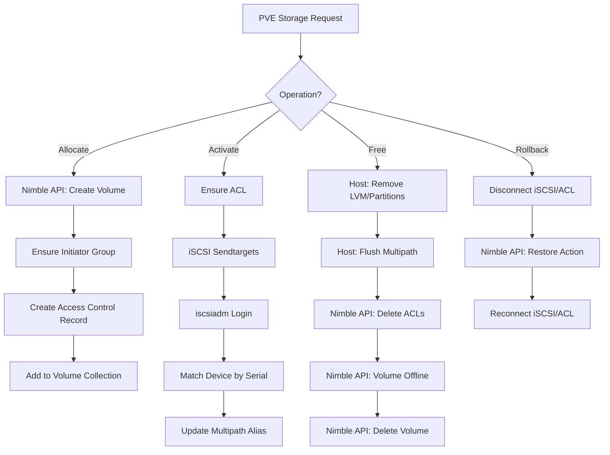

# Nimble Proxmox Storage Plugin Architecture

This document describes the internal workings and operational flow of the HPE Nimble storage plugin for Proxmox VE.

## Overview

The plugin allows Proxmox VE to manage HPE Nimble volumes as iSCSI block storage. It implements the `PVE::Storage::Plugin` API to provide volume lifecycle management, snapshots, and multipath support.

### Key Design Principles
- **Per-Volume IQNs**: Every Nimble volume has its own unique iSCSI target IQN. The plugin manages these targeted sessions rather than relying on a single global target.
- **Cluster-Wide Consistency**: Multipath WWID aliases are cached in `/etc/pve/priv/` (pmxcfs) to ensure all cluster nodes use the same aliases for the same volumes.
- **API Compatibility**: All REST calls follow the HPE Nimble v1 API specification, using a `data` wrapper for request and response bodies.

---

## Core Components

### 1. Configuration & Authentication
- **Sensitive Data**: Passwords are stored in `/etc/pve/priv/storage/<storeid>.pw` to keep them out of the replicated `storage.cfg`.
- **Token Management**: To avoid repeated logins, the plugin caches session tokens in `/etc/pve/priv/nimble/<storeid>.json`.
- **Canonical Keys**: Uses `nimble_` prefixes (e.g., `nimble_address`) to prevent namespace collisions with other plugins.

### 2. Nimble API Layer
The central `nimble_api_call` function handles:
- **Session Tokens**: Attaches `X-Auth-Token` to headers.
- **Request Wrapping**: Automatically wraps bodies in `{ "data": { ... } }`.
- **Error Handling**: Handles 401 Unauthorized by clearing the token cache and retrying once.

### 3. Host-Side iSCSI & Multipath
- **Dynamic Discovery**: 
  - Fetches discovery IPs from Nimble `subnets` API $\rightarrow$ `iscsiadm sendtargets` $\rightarrow$ targeted `iscsiadm --login`.
- **Multipath Aliasing**:
  - Maps WWIDs to friendly aliases (e.g., `<storeid>-<volname>`).
  - Writes configuration to `/etc/multipath/conf.d/nimble-<storeid>.conf`.
  - Uses `PVE::Cluster::cfs_lock_storage` to prevent concurrent write collisions during node migrations.

---

## Operational Flows

### Volume Allocation Flow
When Proxmox requests a new disk (`allocate`):
1. **Array Creation**: `POST /volumes` with size and `multi_initiator: true`.
2. **Access Control**: 
   - Ensures an **Initiator Group** exists (either specified in config or auto-created as `pve-<nodename>`).
   - Creates an **Access Control Record (ACR)** linking the Volume ID to the Initiator Group.
3. **Volume Collection**: If configured, adds the volume to the specified Nimble Volume Collection for array-side protection.

### Volume Activation Flow
When a VM starts or a disk is accessed (`activate`):
1. **ACL Verification**: Ensures the node's Initiator Group has access to the volume.
2. **iSCSI Session**: 
   - Runs `sendtargets` on discovery portals to find the volume's unique IQN.
   - Logins to all available portals for that IQN to ensure multipath redundancy.
3. **Device Discovery**:
   - Rescans SCSI bus.
   - Matches the resulting block device to the **API Serial Number**.
4. **Multipath Registration**: 
   - Extracts WWID $\rightarrow$ Updates cluster-wide WWID cache $\rightarrow$ Updates `/etc/multipath/conf.d/` $\rightarrow$ `multipathd reconfigure`.

### Volume Deletion Flow
When a disk is removed (`free`):
1. **Host Cleanup**: 
   - Removes LVM metadata and partitions from the device.
   - Forces multipath map removal (`multipath -f`).
2. **Array Cleanup**:
   - Deletes all Access Control Records (ACRs) for the volume.
   - Takes the volume **offline** (forcing it if necessary).
   - Deletes all associated array snapshots.
   - Deletes the volume (`DELETE /volumes/:id`).

### Snapshot & Rollback Flow
- **Create**: `POST /snapshots` on the Nimble array.
- **Rollback (Restore)**:
  1. **Disconnect**: Logouts iSCSI sessions and removes ACLs (avoids `SM_vol_has_connections` error).
  2. **Array Restore**: `POST /volumes/:id/actions/restore` with `base_snap_id`.
  3. **Reconnect**: Re-establishes ACLs and iSCSI sessions.

---

## Flow Diagram (Logic)

